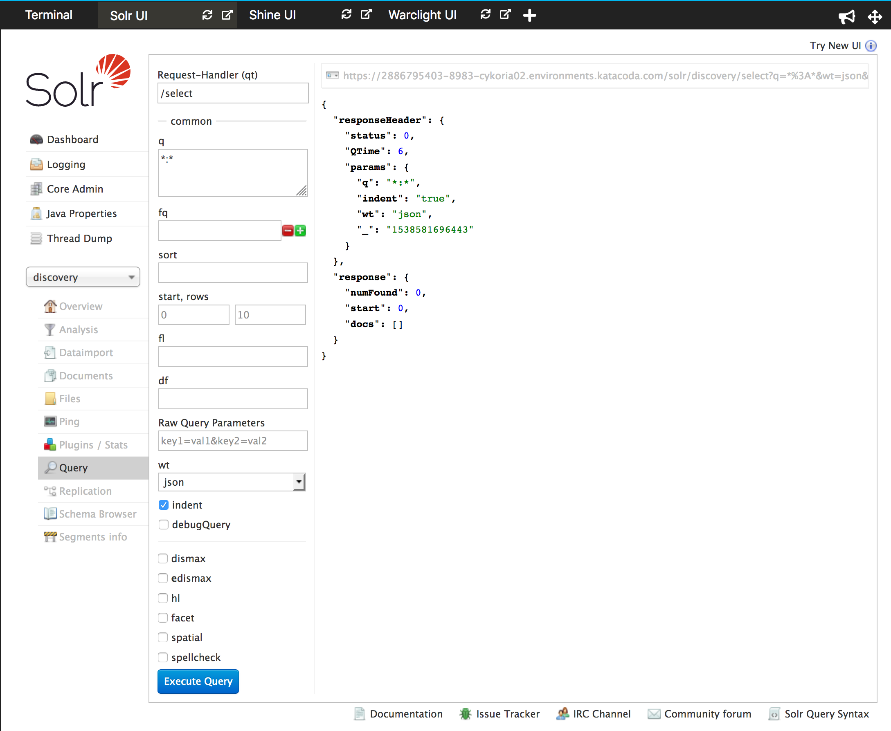

Now Solr is running, we take a look at the built-in Solr UI.

## Task

You should be able to see Solr's built-in interface via the _Solr UI_ tab, or by visiting [this link](https://[[HOST_SUBDOMAIN]]-8983-[[KATACODA_HOST]].environments.katacoda.com/)

Once there:

* Solr can hold multiple databases (known as 'cores') -- select the one called `discovery`.
* On the menu that appears, select the `Query` item, after which the built-in query UI should appear.
* Press `Execute Query` and the default query will run, which matches all records in the database. However, as the database is empty there is nothing to see yet.

Once you're done, it should look like this:

